# Fun things to do with your VM/370 machine

## Intro

This page assumes you have a machine (emulated or not) running the VM370 Community Edition OS available. There are a couple ways to get one, and you might want to choose the one that appeals to you the most (or the one that's less work - it's up to you).

> **Note:** This is still very incomplete - I am accepting suggestions of other fun things to do.

### With Docker

This assumes you have Docker installed. If you do, you can just issue a shell command to have your own machine.

```shell
docker run -n vm370 -p 3270:3270 rbanffy/vm370ce
```

This will bring up the machine and display the Hercules console on your terminal.

### With Hercules

If you don't have Hercules installed on your machine, you can install it on any civilised operating system with its package manager GUI. If you want a command-line shortcut, use something like:

```shell
sudo dnf install sdl-hercules
```

Package name and version varies depending on which operating system you are using. If you are on Windows, you'll need to find the installer - start from the [GitHub repo](https://github.com/SDL-Hercules-390/hyperion).

Then you'll need to set up the VM370 environment. The website at [vm370.org](https://vm370.org/vm370/) details the process.

With that taken out of our way, we can start to have fun.

### Logging on

For normal things, we'll log on to the CMSUSER VM, or, if you renamed it, to your own VM. The default password is "CMSUSER":

On the banner screen, press ENTER.

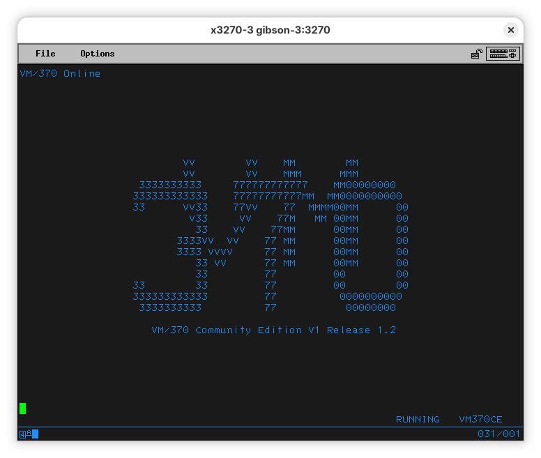

The screen will clear. You can then enter `logon cmsuser`:

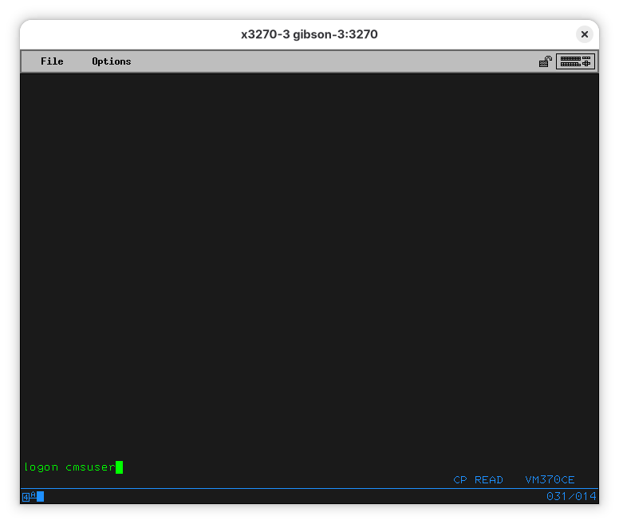

And enter the password, "cmsuser":

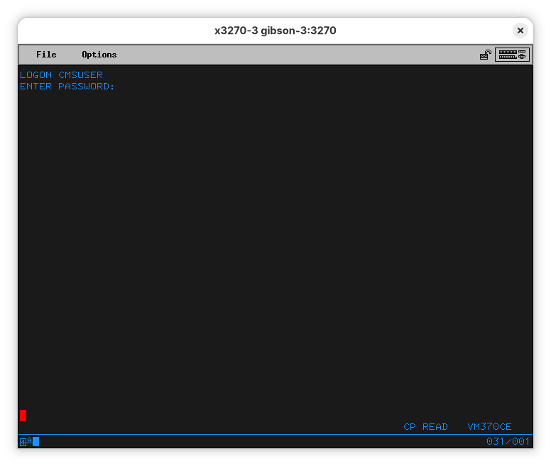

As expected, the password isn't shown. The red cursor means that.

You can also logon using `LOGON CMSUSER CMSUSER`, typing the password after the user name, but that horrifies me even more than having the username as the password. Back when VM/370 was invented, intrusions were a lot less of a problem than they are now. Please do not expose your VM/370 mainframe directly on the internet.

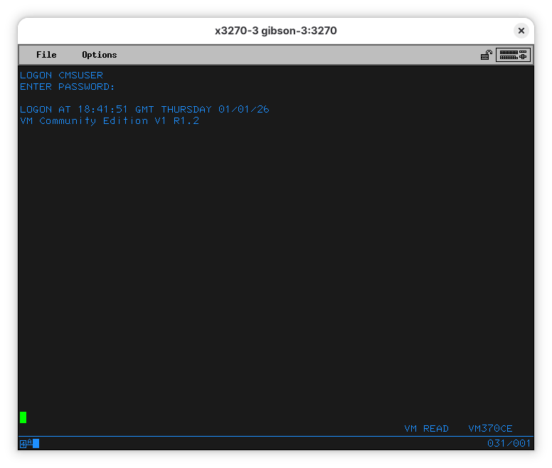

At this point, you are logged on. When you press ENTER another time, a program, called "PROFILE EXEC" will be run:

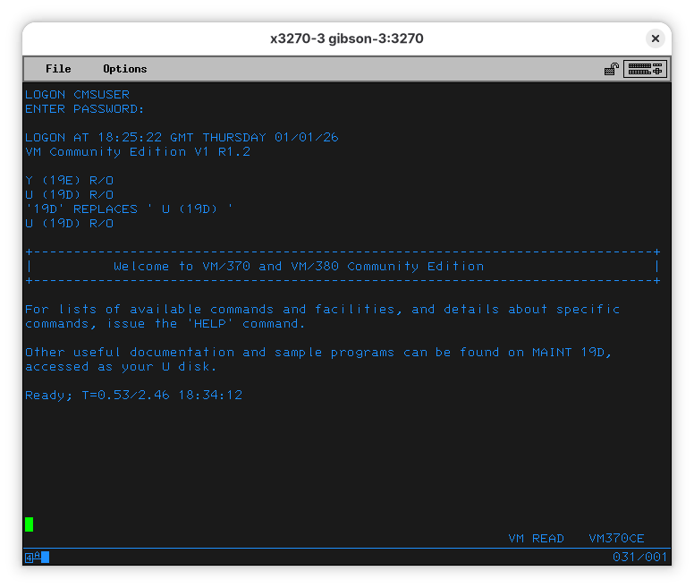

We can examine it. Note that "PROFILE EXEC" means the name is "PROFILE" and the type is "EXEC" (a script). To show the contents of the file, use:

```text
TYPE PROFILE EXEC
```

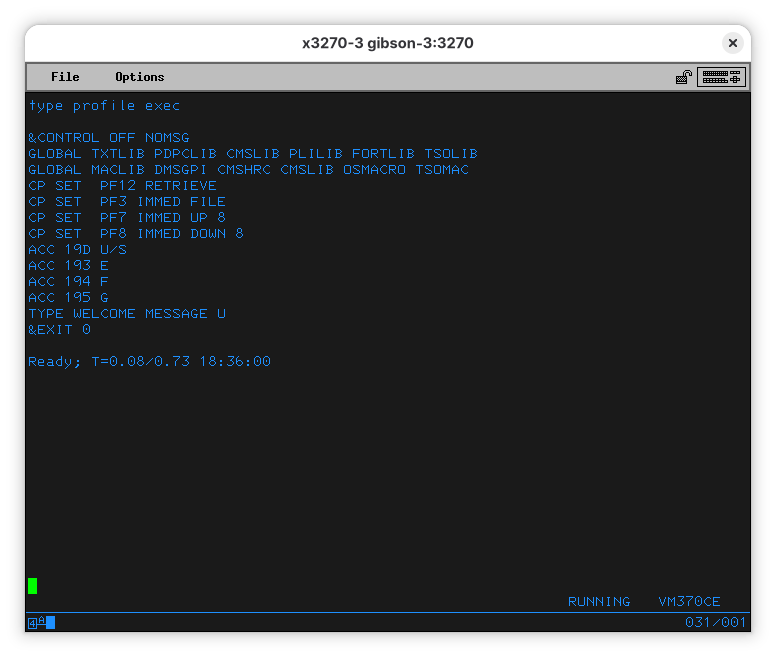

Unlike Unix, commands and file names are case insensitive, so it's fine to type them either way. Be careful, however, so you don't overwrite your files accidentally.

As for the PROFILE program, we'll look at it in more detail later.

### Running a BASIC program

What is a vintage computer without a BASIC interpreter, right?

Let's start with the lamest, most basic BASIC program: a Hello World.

On your terminal, type:

```text
EDIT HELLO BASIC
```

Note that "basic" is not a suffix, but a type - it's a separate parameter. The type of the file is a property of the file and will remain with it unless forcibly changed.

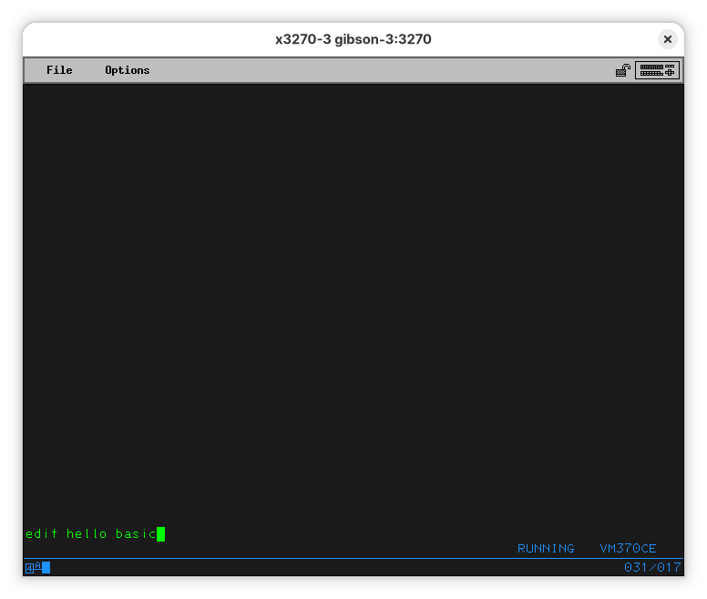

When you press enter (or send) you'll end up on the EDIT program. On the surface, it looks a lot like `vi` from the Unix side: it's terse, hard to use, and sometimes counter-intuitive. It's also hard to guess how to exit it. That's about where the similarities end.

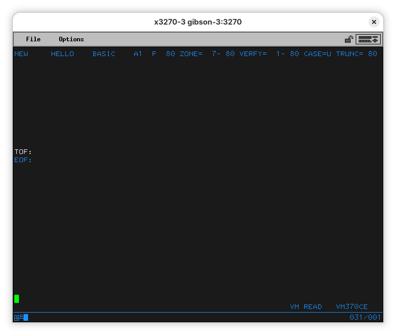

Let's start typing our program:

```basic
10 print 'hello world'
```

When you press enter, you'll see the line was entered. It was also changed to uppercase (see the "CASE=U" at the top line?). Let's save the file and quit the editor. Type "file" and press Enter.

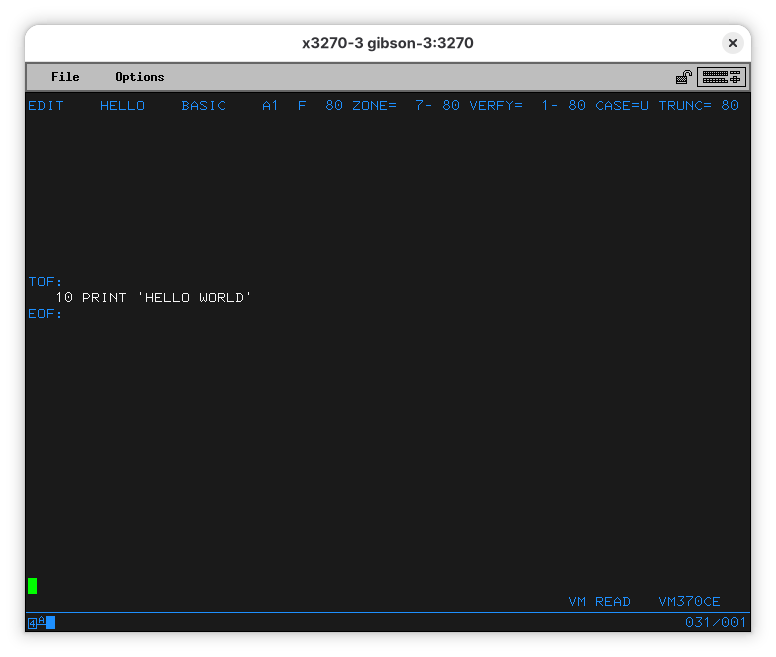

The line at the bottom shows a "MORE..." note. This means the terminal is waiting for you before it shows more output. Press PA2 (Alt-2 for x3270) and you'll see you have exited EDIT.

Now we can run our program:

```text
BASIC HELLO
```

You'll see your command ("basic hello") show up at the top of the screen (after the message indicating EDIT finished), then the message you ordered it to print "HELLO WORLD", followed by another line telling how much CPU it used and how long did it take to run your program.

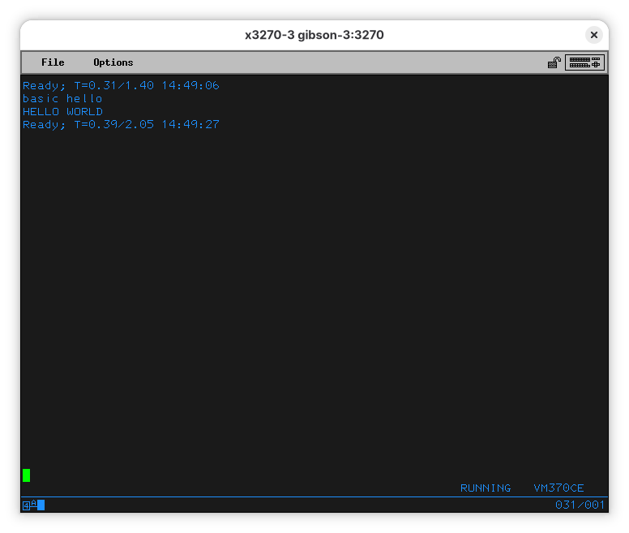

### A bit of FORTRAN

VM/370 CE comes with a couple hello world programs. You can use the `DIR` command to list what files are in the disk you are seeing. We typed our own in BASIC, but there is one in C and one in FORTRAN. Let's see the FORTRAN one:

```text
TYPE HELLO FORTRAN
```

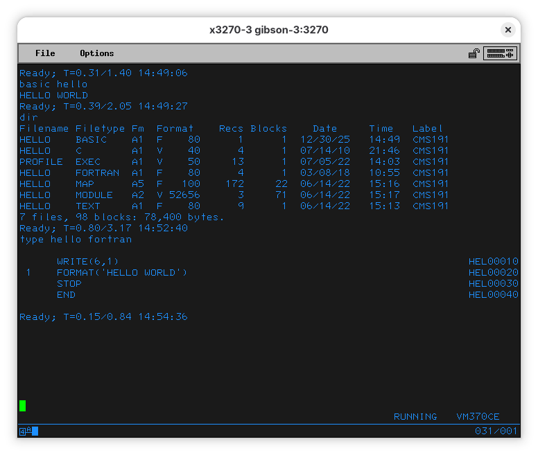

#### Let's compile that FORTRAN program (so we can run it)

To compile it, run:

```text
FORTRAN HELLO
```

The computer will output: 

```text
FORTRAN IV (G) COMPILATION COMPLETE.
Ready; T=0.84/2.59 23:39:34
```

It's about time we mention the message. It's telling me the program run using 0.84 seconds of CPU and took 2.59 seconds to complete. It also told me what time it is for the computer.

After compiling the program, you might have noticed two new files appeared:

```text
HELLO    LISTING  A1  F   120     19      3  01/09/26   23:39  CMS191
HELLO    TEXT     A1  F    80     14      2  01/09/26   23:39  CMS191
```

The first one is a nicely formatted listing, and, in ancient times, you'd find it printed alongside the punched cards you submitted for compilation. It is formatted for 132 columns, as big printers of the time used to be.

```text
   FORTRAN IV G LEVEL  21                 MAIN              DATE = 26009  TIME = 23.39.33             PAGE 0001
    0001              WRITE(6,1)                                                        HEL00010
    0002         1    FORMAT('HELLO WORLD FROM FORTRAN')                                HEL00020
    0003              STOP                                                              HEL00030
    0004              END                                                               HEL00040
   FORTRAN IV G LEVEL  21                 MAIN              DATE = 26009  TIME = 23.39.33             PAGE 0002
 
                                SUBPROGRAMS CALLED
  SYMBOL    LOCATION      SYMBOL    LOCATION      SYMBOL    LOCATION      SYMBOL    LOCATION      SYMBOL    LOCATION
  IBCOM#        90
 
                                FORMAT STATEMENT MAP
  SYMBOL    LOCATION      SYMBOL    LOCATION      SYMBOL    LOCATION      SYMBOL    LOCATION      SYMBOL    LOCATION
       1        94
 
     *OPTIONS IN EFFECT*  ID,EBCDIC,SOURCE,NOLIST,NODECK,LOAD,MAP
     *OPTIONS IN EFFECT*  NAME = MAIN    , LINECNT =       60
     *STATISTICS*    SOURCE STATEMENTS =        4,PROGRAM SIZE =      298
     *STATISTICS*  NO DIAGNOSTICS GENERATED
```

The other is telling me it's a text, but it appears it's a lie:

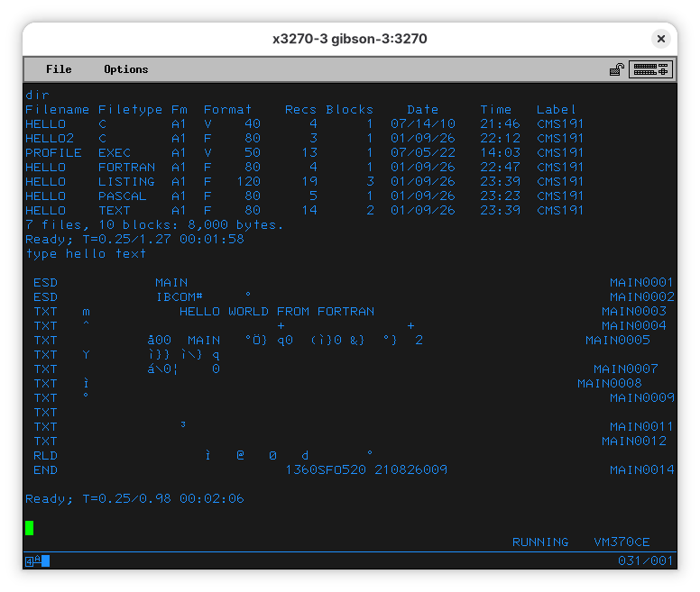

In order to run the Fortran program we just compiled, we'll do:

```text
LOAD HELLO ( START
```

Let's see what that means:

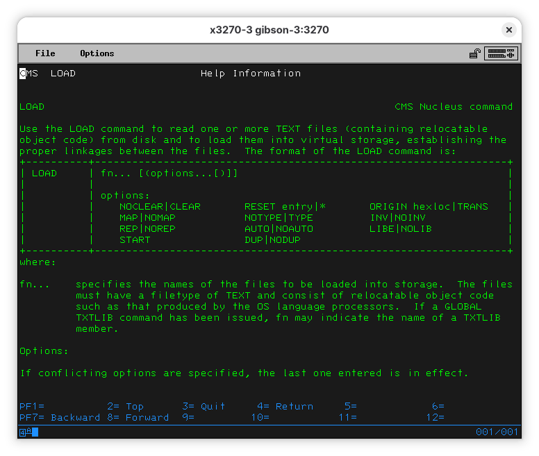

So... `LOAD` will load one or more relocatable object code, which is the `TEXT` file (we knew it was a lie!). So, we are asking LOAD to load the `HELLO TEXT` file, and we are passing the `START` option to it (so the code runs).

```text
LOAD HELLO ( START
Execution begins...
Ready; T=1.23/3.90 00:09:54
```

Looks like nothing happened. But it actually did. There is a new file:

```text
FILE     FT06F001 A1  V    24      1      1  01/10/26    0:09  CMS191
```

If we look into it, we'll see:

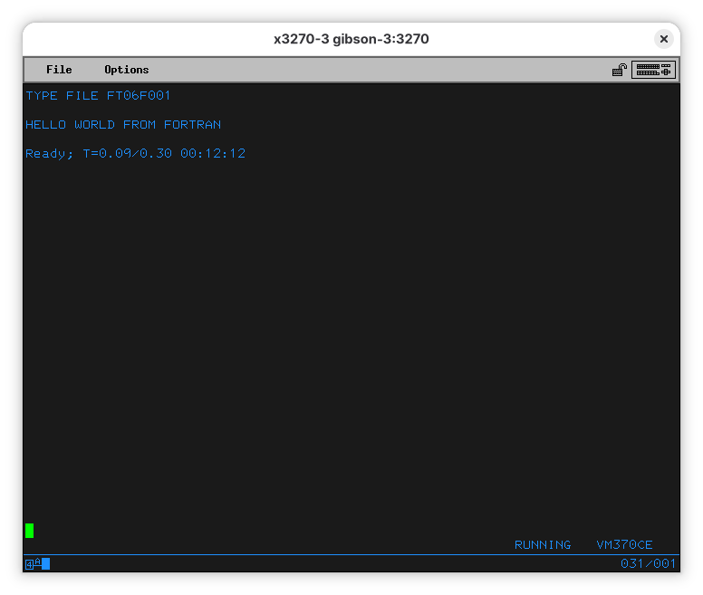

So, the program ran, and the output went into this oddly named file.

See the "6" in the middle of the file type? We can redirect the output to the terminal:

```text
FILEDEF 6 TERMINAL
```

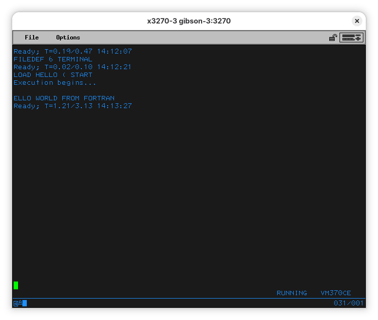

Now the program outputs to the terminal. Why the first character is missing is an interesting problem. I am not sure why this is happening, neither are my current mainframe gurus. Our current best guess is that "H" would be telling something to the terminal and, therefore, the terminal isn't showing it. If you know, please file a bug and a PR with an explanation.

What was the magic we used? Let's see what FILEDEF does. Do a `HELP FILEDEF`:

```text
FILEDEF                                                   CMS Transient command
                                                                               
Use the FILEDEF command to establish data definitions for OS ddnames, to define
files to be copied with the MOVEFILE command, or to override default file      
definitions made by the assembler and the OS language processors.  The format  
of the FILEDEF command is:                                                     
+----------+------------------------------------------------------------------+
| FIledef  | ddname nn *  device                                              |
|          |                                                                  |
|          | device:                                                          |
|          |    Terminal [(optionA optionD[)]]                                |
|          |    PRinter  [(optionD[)]]                                        |
|          |    PUnch    [(optionD[)]]                                        |
|          |    Reader   [(optionD[)]]                                        |
|          |    DISK [FILE|fn ddname|ft [A1|fm]] [DSN ?|q1 q2 ...]            |
|          |             [(optionA optionB[)]]                                |
|          |    DUMMY    [(optionA[)]]                                        |
|          |    TAPn     [(optionA optionC[)]]                                |
|          |    CLEAR                                                         |
|          | optionA:                                                         |
|          |    BLOCK|BLKSIZE nnnnn  CHANGE|NOCHANGE     LRECL nnnnn          |
|          |    PERM                 RECFM a                                  |
|          | optionB:                                                         |
|          |    CONCAT               DISP MOD            DSORG PS|PO|DA|IS    |
|          |    KEYLEN nnn           LIMCT nnn           MEMBER name          |
|          |    OPTCD a              XTENT 50|nnnnn                           |
|          | optionC:                                                         |
|          |    7TRACK|9TRACK        TRTCH a             DEN den              |
|          | optionD:                                                         |
|          |    UPCASE|LOWCASE                                                |
+----------+------------------------------------------------------------------+
where:                                                                         
                                                                               
ddname | nn | *                                                                
         is the name  by which the file is referred to in your program.  OS    
         ddname syntax rules should be followed.  If a number nn is specified, 
         it is translated to a FORTRAN data definition name of FTnnF001.  An   
         asterisk (*) may be specified with the CLEAR operand to indicate that 
         all file definitions not entered with the PERM option should be       
         cleared.                                                              
                                                                               
Devices:                                                                       
                                                                               
Terminal is your terminal (terminal I/O must not be blocked).  Terminal input  
         will be truncated to the console input buffer length of 130           
         characters.                                                           
```

... and so on. Fortran, by default, outputs to whatever is defined as file "6", which ends up being "FILE FT06F001". This is all related to the way batch processes were set up where things like input and outputs were specified by a configuration for when a program is run. This was done in a language called JCL (for Job Control Language). It was uncommon for programs to be run interactively at the terminal, and even having a terminal was considered a luxury most programmers didn't have - they'd submit their code in special forms that someone else would type, convert to punch cards, and feed to the compiler.

#### Running our own programs

There is a lot of code you can use. For exaple, the [IBM System/360 Operating System FORTRAN IV Programmer's Guide](https://bitsavers.org/pdf/ibm/360/fortranGC28-6817-4_OS360_FORTRAN_IV_G_and_H_Programmers_Guide_197309.pdf) has an example, [primes.fortran](primes.fortran) I copied into this repo:

```fortran
C PRIME NUMBER PROBLEM
C FROM IBM System/360 Operating System FORTRAN IV Programmers Guide
C https://bitsavers.org/pdf/ibm/360/fortran/
C GC28-6817-4_OS360_FORTRAN_IV_G_and_H_Programmers_Guide_197309.pdf
C page 108
C Modified for brevity from 1 to 1000 to 1 to 100
  100 WRITE (6,8)
    8 FORMAT (52H FOLLOWING IS A LIST OF PRIME NUMBERS FROM 1 TO 100 /
     X 119X,1H1/19X,1H2/19X,1H3)
  101 I=5
    3 A=I
  102 A=SQRT(A)
  103 J=A
  104 DO 1 K=3,J,2
  105 L=I/K
  106 IF(L*K-I)1,2,4
    1 CONTINUE
  107 WRITE (6,5)I
    5 FORMAT (I20)
    2 I=I+2
  108 IF(100-I)7,4,3
    4 WRITE (6,9)
    9 FORMAT (14H PROGRAM ERROR)
    7 WRITE (6,6)
    6 FORMAT (31H THIS IS THE END OF THE PROGRAM)
  109 STOP
      END
```

When you upload it, make sure it's fixed length at 80 characters, as punched cards were. If you forget, you'll get a helpful error message:

```text
FILE 'PRIMES FORTRAN' IS NOT FIXED, 80 CHAR. RECORDS.
```

Upload like this:

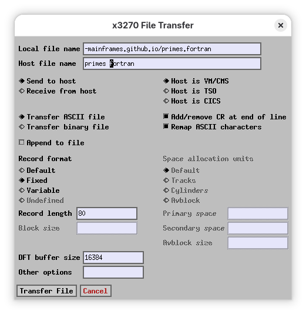

You'll now see that the file is now of fixed 80 character width (`F 80` in the format column).

```text
Filename Filetype Fm  Format    Recs Blocks    Date     Time   Label
...
PRIMES   FORTRAN  A1  F    80     27      3  01/11/26   14:47  CMS191
```

Now you can compile and run it:

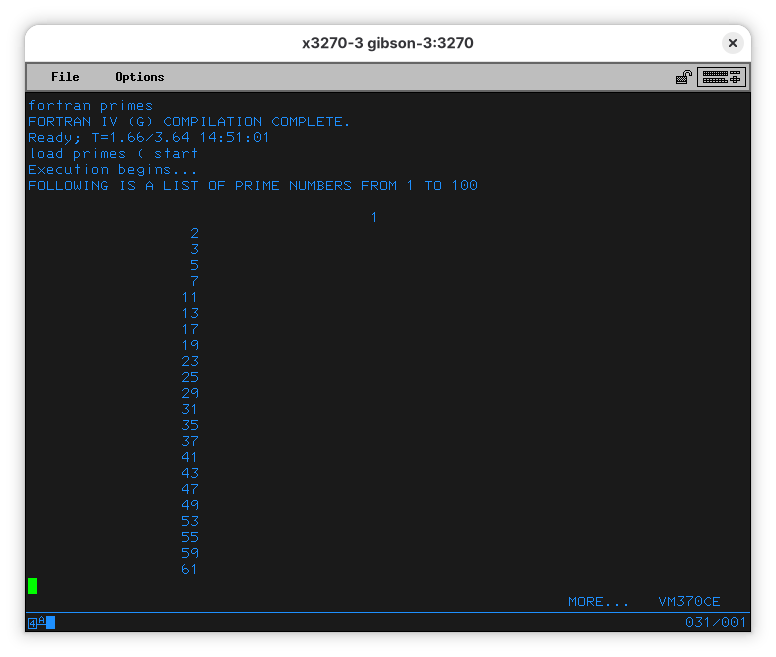

Again we see some oddness at the start of the output.

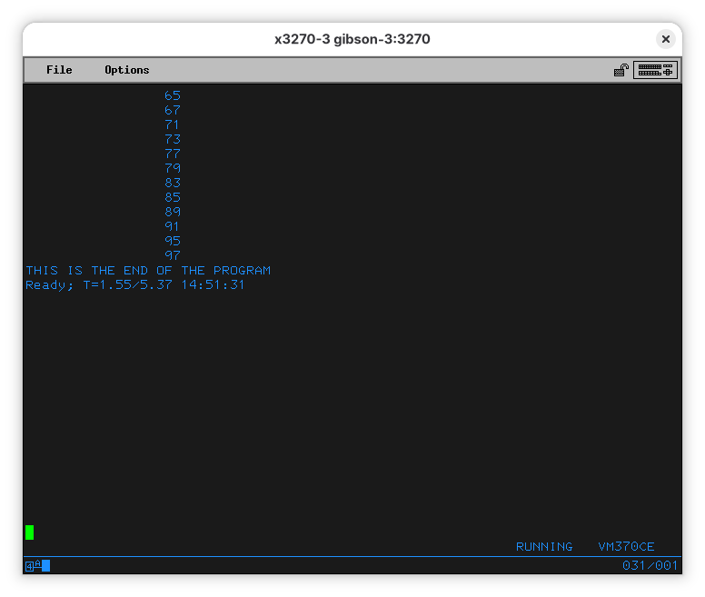

... but we can see the program completed successfully.

#### Other interesting languages available

##### C

##### Pascal

##### ALGOL

This is interesting - there is a VM without a login that has the name ALGOL. [TBA]

### Navigating the disks

The VM370CE distribution has a lot of disks. You can check which ones you have immediate access with. If you logged on as CMSUSER, you can use the LISTFILE (we abreviated it to "LIST") command to see what files are on your default disk. In CMS, commands can be abbreviated - the actual command is `LISTFILE` but `LIST` is neat enough.

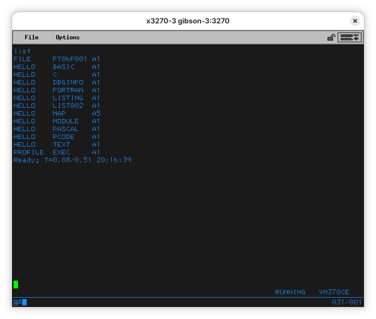

To check the disks you have, use `QUERY DISK` (query can also be abbreviated - `Q` will suffice for the computer to understand what you want):

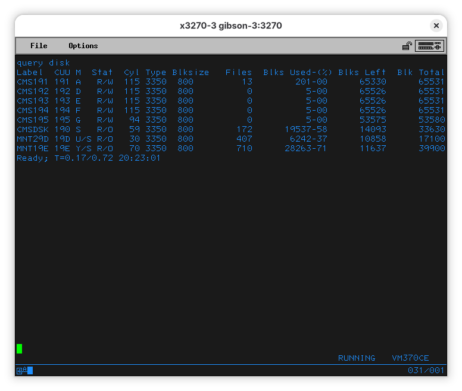

To list what's on a disk, you'll use `LISTFILE * * [disk]`. The first "*" is a wildcard that will show all file names, the second is for all types. If you are familiar with windcards from CP/M, MS-DOS, or Unix, these don't behave the same.

he third parameter is the disk:

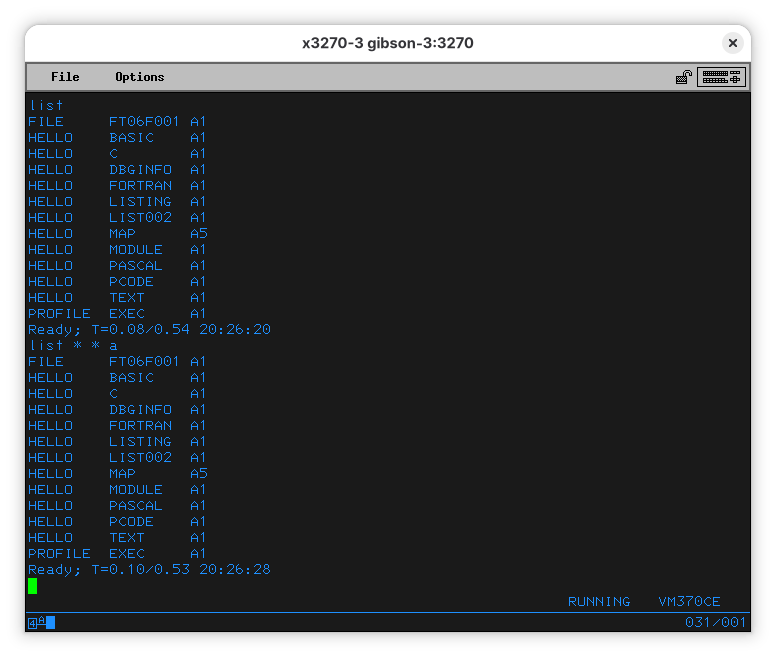

So... Looking at the output of `LISTFILE` and `LISTFILE * * A`, we can conclude we were start from disk A. In this case, A is a shortcut to disk 191 (mainframes always were supposed to have lots of disks, and our emulated one - a tricked out 4381 - has more than most companies could afford, or that would fit in most period accurate computer rooms). In our case, 191 is the "address" of the disk, and tells where the disk is connected to the virtual machine. Disks also have 6-character labels (or "VOLSER" in mainframe slang). A is "CMS190".

Let's check the other disks:

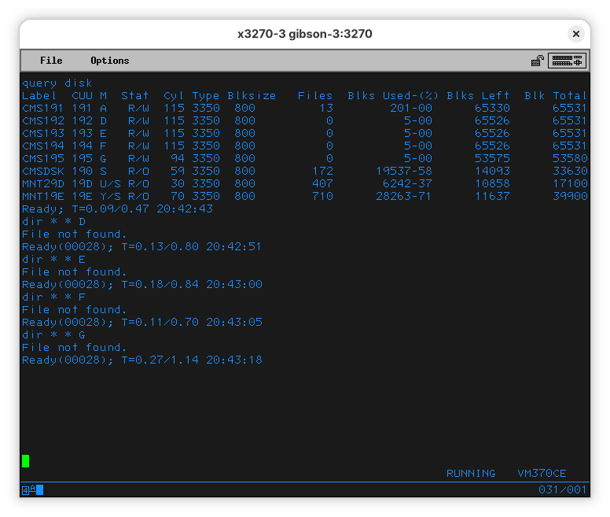

Disks D, E, F, and G are empty. That wouldn't be a surprise if we had paid attention to the output of `QUERY DISK` - it clearly says they have zero files, and use 5 blocks (rounded to 0% of the disk).

There is also disk S (or 190, or ). It has 172 files, so it'll take a couple pages to list everything. In the list you'll see a lot of interesting files - this disk contains system utilities - there's ACCESS, EDIT, QUERY, SET, SORT, GLOBAL, and other things that we have seen before or that look like things an OS would provide (not a big surprise, as its label is "CMSDSK"). Binary programs seem to be of type "MODULE". Let's remember that. Try listing all files of type MODULE in S:

```text
DIR * MODULE S
```

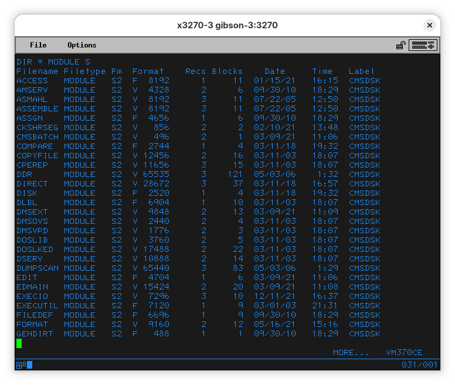

[Other disks TBA]

### Uploading files to your machine (and playing games)

For this example, we'll use the `GAMES.VMARC` file available at the [h390-vm group at groups.io](https://groups.io/g/h390-vm). The easiest way to upload a file to your mainframe is with the x3270 app - on the File menu select "File Transfer":

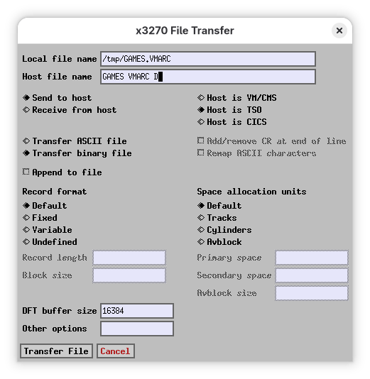

Since we are uploading a VMARC file (think a .zip or .tar.bz2), we'll chose a binary transfer. The file will be saved to our disk D. 

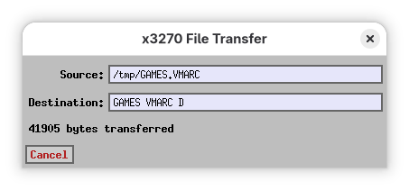

It might be a while if you are running Hercules on an underpowered Raspberry Pi Zero W. I assume a local instance on a sensible computer will be a lot faster. When the transfer is finished, a new dialog will pop up telling you so.


Now we need to understand how to open a VMARC file. Luckily for us, VM370CE has a very comprehensive help system. On the terminal, issue a:

```text
HELP VMARC
```

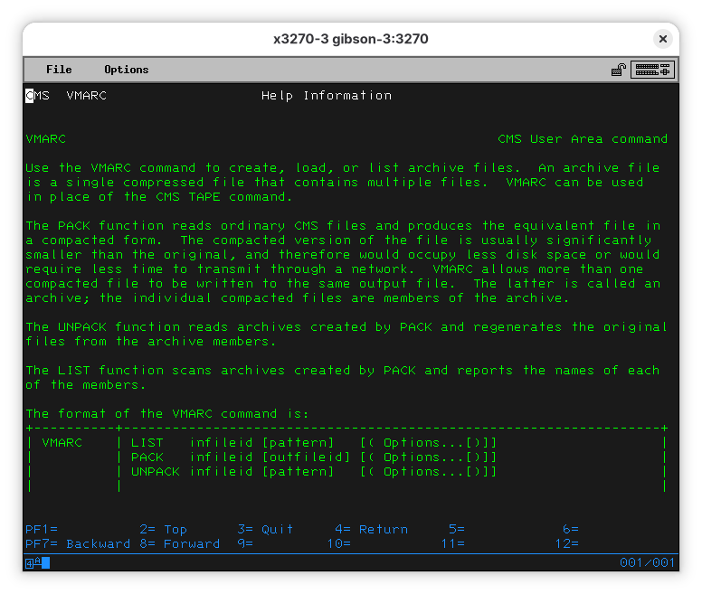

Listing the contents of the file seems like a good first step:

```text
VMARC LIST GAMES VMARC D
```

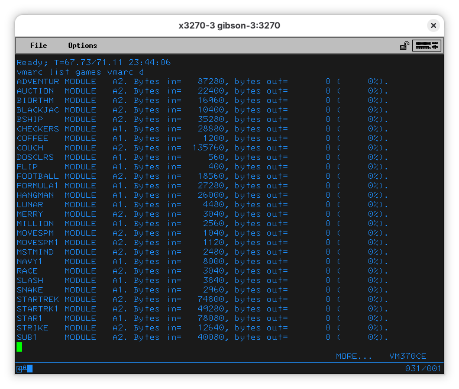

Let's get one of the games:

```text
VMARC UNPACK GAMES VMARC D TICTOE MODULE D
```

It's there!

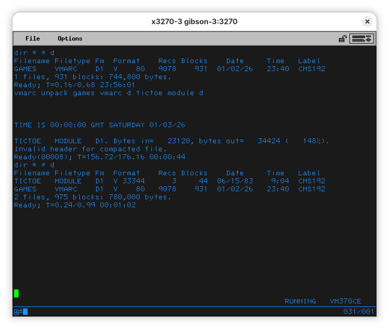

Now we want to run it.

```text
TICTOE
```

... and it works!

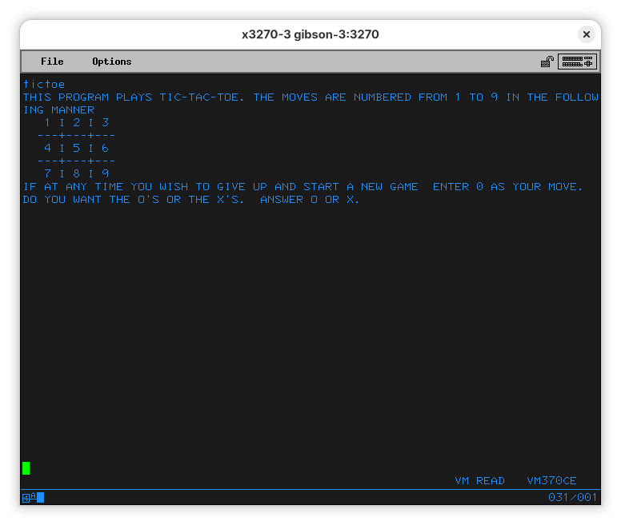

As most people know, the only winning move with Tic Tac Toe (and Global Thermonuclear War) is not to play. The other games are a lot more interesting.

### Moar games

Other two game archives that are easy to obtain are under the [VM-370-Games](https://github.com/marXtevens/VM-370-Games) repo on Github. Once you download the files to your desktop and sent them to your VMS machine, you'll have:

```text
Filename Filetype Fm  Format    Recs Blocks    Date     Time   Label
VM86F155 VMARC    D1  V    80  15578   1597  01/03/26    1:20  CMS192
ZORK     VMARC    D1  V    80   8865    909  01/03/26    0:37  CMS192
```

The first one, `VM86F155`, has a lot of games in BASIC you can explore and modify (it you figure out how `EDIT` works).

The ZORK code is in FORTRAN, and, while there is a program called `GENZORK`, it fails (maybe it needs to run on a disk at B).

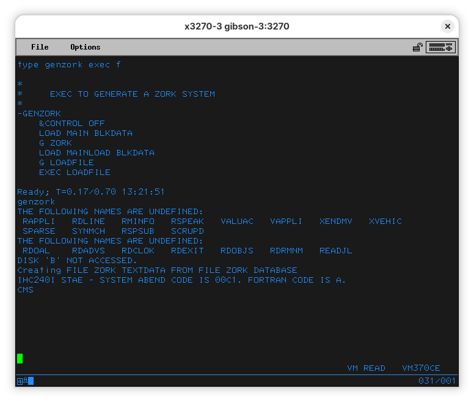

Let me know if you figure it out.

[Solution TBA]

### Adding a user for you

It's no fun to log in as CMSUSER every time you want to do something. You'll want a user for yourself, with reasonable permissions to do things to the machine. In my case, I want to create an "RBANFFY" user for me.

Here's the first shock for those who come from other platforms - you wouldn't create a user, you'd create a VM, and you log in to that VM.

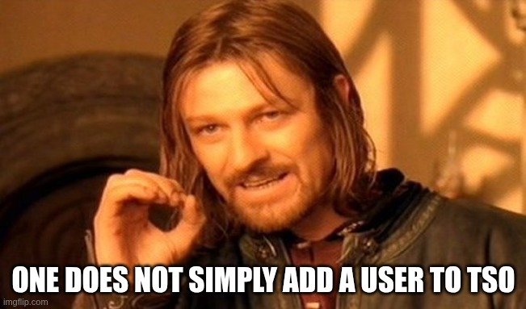

Creating a VM is a bit involved - you'll need to do a lot of things before - allocate and format storage, for instance. We'll leave that for later.

In the meantime, if you want to rename the CMSUSER VM to your preferred name (and changing the password), we can explain that For that, we'll start logging on as MAINT (which means, logging on to the MAINT VM).

#### Editing USER DIRECT

#### Updating the USER directory

### Talking to other mainframes

#### Mounting a disk on another running Hercules instance

Hercules can run without a UI in [Shared Device Server](https://sdl-hercules-390.github.io/html/shared.html) mode. In this mode, it can start and no environment needs to be IPL'ed.

[Details TBA]

#### TCP/IP networking on VM370

[TBA]

### Printing

#### To a virtual printer

Hercules supports routing a printer to a local file. On the packaged version of MVT 3.8j a [1403 line printer](https://en.wikipedia.org/wiki/IBM_1403) is mapped to the `prt/prt00f.txt` file, and on VM/370 there are two 1403 printers, mapped to `io/print1.listing` and `io/print2.listing`. On the container images, these files are not exposed to the host directly, and you'll have to map the container folder to the host yourself.

#### To a real printer

[TBA]

### Using a "normal" terminal

Enabling access via a printing terminal (not screen-based).

&copy; 2025-2026 Ricardo Bánffy